# 🤖 AppMCP

> **AI-Powered macOS Application Automation via Model Context Protocol**

[](https://swift.org)
[](https://developer.apple.com/macos/)
[](https://github.com/modelcontextprotocol/swift-sdk)
[](LICENSE)

**AppMCP** bridges the gap between AI models and macOS applications, enabling intelligent automation through visual inspection, UI interpretation, and precise control of native applications.

---

## ✨ Features

### 🎯 **Visual Intelligence**
- **Smart Screenshots**: Capture high-resolution app windows using ScreenCaptureKit
- **OCR Text Recognition**: Extract text from screenshots using Apple's Vision Framework
- **UI Tree Analysis**: Extract detailed accessibility hierarchies for precise element targeting
- **Multi-App Discovery**: Identify and monitor multiple running applications simultaneously

### 🛠 **Automation Toolkit**
- **Precise Interactions**: Mouse clicks, keyboard input, and gesture automation
- **Smart Waiting**: Intelligent delays and condition-based waiting mechanisms
- **Error Recovery**: Robust fallback strategies for reliable automation

### 🔒 **Privacy & Security**
- **Permission Management**: Seamless TCC (Transparency, Consent, and Control) integration
- **Secure Communication**: JSON-RPC over STDIO with structured error handling
- **Bundle ID Validation**: Verified application targeting for enhanced security

---

## 🚀 Quick Start

### Prerequisites
- **macOS 15.0+** (Sequoia or later)
- **Swift 6.1+**
- **Xcode 16.0+**

### Installation

```bash
# Clone the repository
git clone https://github.com/your-username/AppMCP.git
cd AppMCP

# Build the project
swift build -c release

# Run the daemon
./.build/release/appmcpd --stdio
```

### Permissions Setup

AppMCP requires the following macOS permissions:

1. **🔓 Accessibility**: System Preferences → Privacy & Security → Accessibility
2. **📺 Screen Recording**: System Preferences → Privacy & Security → Screen Recording

*The application will guide you through the permission setup process.*

---

## 🎮 Usage Examples

### Weather App Automation

```python
import json
import subprocess

# Start AppMCP server
process = subprocess.Popen(['./appmcpd', '--stdio'])

# Take screenshot of Weather app
request = {
    "jsonrpc": "2.0",
    "id": 1,
    "method": "resources/read",
    "params": {"uri": "app://app_screenshot"}
}

# Send request and get response
response = send_mcp_request(request)
print(f"📸 Screenshot captured: {response['result']['contents'][0]['text']}")
```

### UI Element Discovery

```python
# Get accessibility tree
request = {
    "jsonrpc": "2.0",
    "id": 2,
    "method": "resources/read",
    "params": {"uri": "app://app_accessibility_tree"}
}

tree = send_mcp_request(request)
print(f"🌳 UI Elements: {tree['result']['contents'][0]['text']}")
```

### Automated Interactions

```python
# Click on coordinates
request = {
    "jsonrpc": "2.0",
    "id": 3,
    "method": "tools/call",
    "params": {
        "name": "mouse_click",
        "arguments": {"x": 300, "y": 150}
    }
}

# Type text
request = {
    "jsonrpc": "2.0",
    "id": 4,
    "method": "tools/call",
    "params": {
        "name": "type_text",
        "arguments": {"text": "Tokyo"}
    }
}
```

---

## 🏗 Architecture

```mermaid
graph TB
    A[🤖 AI Model] -->|JSON-RPC| B[📡 MCP Server]
    B --> C[🔍 Resources]
    B --> D[🛠 Tools]
    
    C --> E[📱 App Screenshot]
    C --> F[🌳 Accessibility Tree]
    C --> G[📋 Running Apps]
    
    D --> H[🖱 Mouse Control]
    D --> I[⌨️ Keyboard Input]
    D --> J[⏱ Wait Functions]
    
    E --> K[📱 macOS Apps]
    F --> K
    G --> K
    H --> K
    I --> K
    J --> K
```



### Core Components

| Component | Description | Technology |
|-----------|-------------|------------|
| **🎯 AppSelector** | Application discovery and targeting | AppKit, NSWorkspace |
| **📸 ScreenCaptureProvider** | High-quality screenshot capture | ScreenCaptureKit (macOS 15+) |
| **🌳 AppAXTreeProvider** | Accessibility tree extraction | Accessibility API |
| **🖱 MouseClickTool** | Precise mouse automation | CGEvent, Quartz |
| **⌨️ KeyboardTool** | Text input and shortcuts | CGEvent, Carbon |
| **🔒 TCCManager** | Permission management | TCC Framework |

---

## 📦 Package Structure

```
AppMCP/
├── 📁 Sources/
│   └── 📁 AppMCP/
│       ├── 🎯 AppMCP.swift          # Core protocols & types
│       ├── 🖥 MCPServer.swift        # Main MCP server
│       ├── 📁 Resources/            # Data providers
│       ├── 📁 Tools/                # Automation tools
│       └── 📁 Permissions/          # Security management
├── 📁 Sources/appmcpd/
│   └── 🚀 Command.swift             # CLI daemon
├── 📁 Tests/
│   └── 📁 AppMCPTests/              # Comprehensive test suite
├── 📋 Package.swift                 # Swift Package configuration
└── 📖 CLAUDE.md                     # Development guidelines
```

---

## 🧪 Testing

### Run All Tests
```bash
swift test
```

### Test Categories
- **🔧 Unit Tests**: Core functionality validation
- **🔗 Integration Tests**: End-to-end workflow testing
- **⚡ Performance Tests**: Response time benchmarking
- **🛡 Security Tests**: Permission and validation checks

### Example Test Results
```
Test Suite 'AppMCPTests' passed at 2025-06-04 16:42:04.049
    Executed 19 tests, with 0 failures (0 unexpected) in 0.015 seconds
✅ All tests passing
```

---

## 🛠 API Reference

### MCP Tools

AppMCP provides the following specialized tools for macOS automation:

#### Screenshot & UI Analysis
- **`capture_ui_snapshot`**: Capture screenshot with UI element hierarchy
  - Optional text recognition via Vision Framework
  - Element filtering with queries
  - Returns base64 screenshot + structured UI data
  
- **`recognize_text_in_screenshot`**: 🆕 OCR text extraction from app windows
  - Multi-language support (en-US, ja-JP, zh-Hans, etc.)
  - Fast vs accurate recognition modes
  - Confidence scores and bounding boxes

#### Automation Controls
- **`click_element`**: Element-based clicking with multi-button support
- **`input_text`**: Text input with setValue/type methods
- **`drag_drop`**: Drag and drop between elements
- **`scroll_window`**: Scrolling at specific element locations

#### App Discovery
- **`list_running_applications`**: Get all running apps with metadata
- **`list_application_windows`**: List windows with bounds and visibility

### Text Recognition Features

The Vision Framework integration provides powerful OCR capabilities:

```json
{
  "bundleID": "com.apple.TextEdit",
  "includeTextRecognition": true,
  "recognitionLanguages": ["en-US", "ja-JP"],
  "recognitionLevel": "accurate"
}
```

**Recognition Results:**
- Full text extraction in reading order
- Individual text regions with confidence scores
- Bounding boxes in normalized coordinates
- Support for 50+ languages
- Handwritten text detection

---

## 🎯 Roadmap

### 🌟 Current (v1.0.0)
- [x] Weather app automation PoC
- [x] Basic screenshot & UI tree extraction
- [x] Mouse & keyboard automation
- [x] Permission management
- [x] Vision Framework OCR text recognition

### 🚀 Near Future (v0.2.0)
- [ ] Multi-app simultaneous control
- [ ] DevTools integration
- [ ] Enhanced error recovery
- [ ] Performance optimizations

### 🔮 Long Term (v1.0.0)
- [ ] HTTP transport support
- [ ] Shortcuts.app integration
- [ ] Plugin SDK for extensions
- [ ] Real-time UI streaming

---

## 🤝 Contributing

We welcome contributions! Please see our [Contributing Guidelines](CONTRIBUTING.md) for details.

### Development Setup
```bash
# Install dependencies
swift package resolve

# Run tests
swift test

# Format code
swift-format -i -r Sources/ Tests/

# Build for development
swift build
```

---

## 📄 License

AppMCP is released under the **MIT License**. See [LICENSE](LICENSE) for details.

---

## 🙏 Acknowledgments

- **[Model Context Protocol](https://github.com/modelcontextprotocol/swift-sdk)** - For the excellent MCP Swift SDK
- **Apple Developer Team** - For the powerful macOS automation APIs
- **Swift Community** - For the robust Swift ecosystem

---

<div align="center">

**Built with ❤️ for the AI automation community**

[📖 Documentation](docs/) • [🐛 Issues](https://github.com/your-username/AppMCP/issues) • [💬 Discussions](https://github.com/your-username/AppMCP/discussions)

</div>